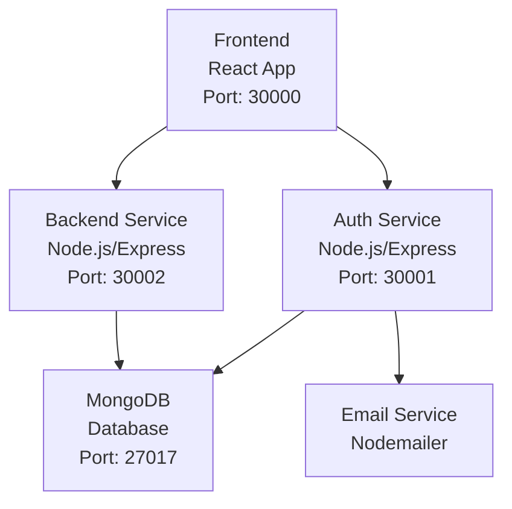

# MLOps Microservices Application

A full-stack MLOps platform built with microservices architecture, featuring user authentication, backend services, and a modern React frontend. Deployed on Kubernetes for scalability and reliability.

## Architecture



### Components

- **Frontend**: React-based web application providing the user interface for authentication and dashboard access.
- **Auth Service**: Handles user registration, login, password reset, and JWT token management.
- **Backend Service**: Core business logic and API endpoints for the MLOps platform.
- **MongoDB**: NoSQL database for storing user data and application state.
- **Kubernetes**: Container orchestration for deploying and managing all services.

## Features

- User authentication (signup, login, password reset)
- JWT-based session management
- Microservices architecture
- Kubernetes deployment with load balancing
- Persistent storage for database
- Health check endpoints
- Docker containerization

## Prerequisites

- Docker
- kubectl
- Minikube (for local Kubernetes cluster)
- Node.js (for local development)

## Quick Start

### One-Click Deployment

Run the automated deployment script:

```bash
./start.sh
```

This script will:
- Check prerequisites
- Start Minikube
- Build Docker images
- Deploy all services to Kubernetes
- Run health checks
- Provide access URLs

### Manual Setup

1. **Start Minikube**:
   ```bash
   minikube start --cpus=4 --memory=8192 --driver=docker
   ```

2. **Configure Docker**:
   ```bash
   eval $(minikube docker-env)
   ```

3. **Build Images**:
   ```bash
   docker build -t mlops-frontend:latest ./frontend
   docker build -t mlops-backend:latest ./backend
   docker build -t mlops-auth-service:latest ./auth-service
   ```

4. **Deploy to Kubernetes**:
   ```bash
   kubectl apply -f k8s/

   kubectl port-forward -n kubernetes-dashboard service/kubernetes-dashboard 8080:80 --address='0.0.0.0' &
   ```

5. **Access the Application**:
   - Frontend: `http://$(minikube ip):30000`
   - Auth API: `http://$(minikube ip):30001`
   - Backend API: `http://$(minikube ip):30002`

## Local Development

### Frontend
```bash
cd frontend
npm install
npm start
```

### Auth Service
```bash
cd auth-service
npm install
npm run dev
```

### Backend Service
```bash
cd backend
npm install
npm run dev
```

### Database
MongoDB runs in a Docker container as part of the Kubernetes deployment.

## API Endpoints

### Auth Service (Port 30001)
- `POST /api/auth/signup` - User registration
- `POST /api/auth/login` - User login
- `POST /api/auth/forgot-password` - Password reset request
- `POST /api/auth/reset-password` - Password reset
- `GET /health` - Health check

### Backend Service (Port 30002)
- `GET /health` - Health check
- Additional endpoints for MLOps functionality

## Environment Variables

Create `.env` files in each service directory with necessary configuration:

### Auth Service
```
MONGODB_URI=mongodb://mongodb:27017/authdb
JWT_SECRET=your-secret-key
EMAIL_USER=your-email@gmail.com
EMAIL_PASS=your-email-password
```

### Backend Service
```
MONGODB_URI=mongodb://mongodb:27017/backenddb
JWT_SECRET=your-secret-key
```

## Deployment Scripts

- `start.sh`: Automated deployment to Minikube
- `deploy-k8s.sh`: Alternative deployment script
- `docker-compose.yml`: Local development with Docker Compose

## Monitoring

- Check pod status: `kubectl get pods`
- View logs: `kubectl logs -l app=<service-name>`
- Access Kubernetes dashboard: `minikube dashboard`

## Contributing

1. Fork the repository
2. Create a feature branch
3. Make your changes
4. Test locally
5. Submit a pull request

## License

ISC License